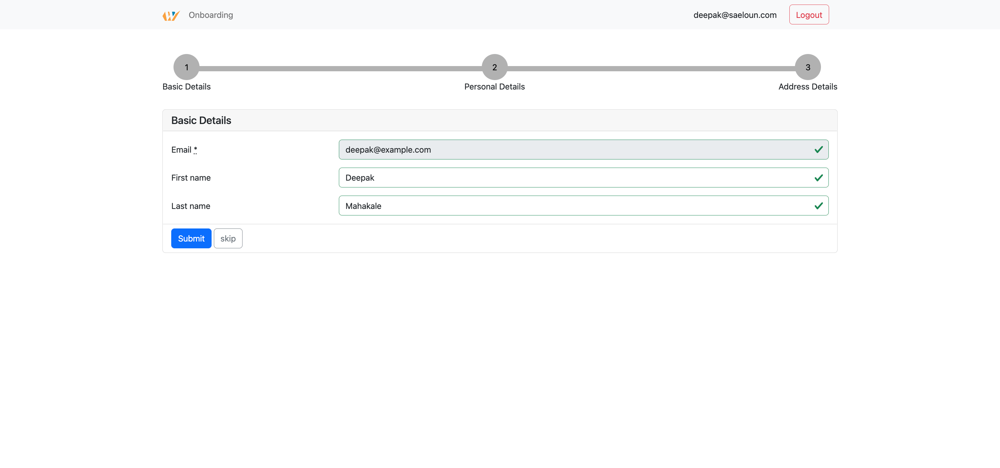
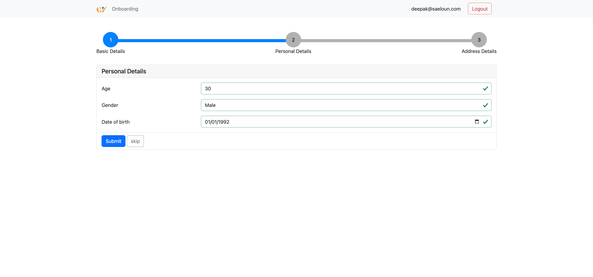
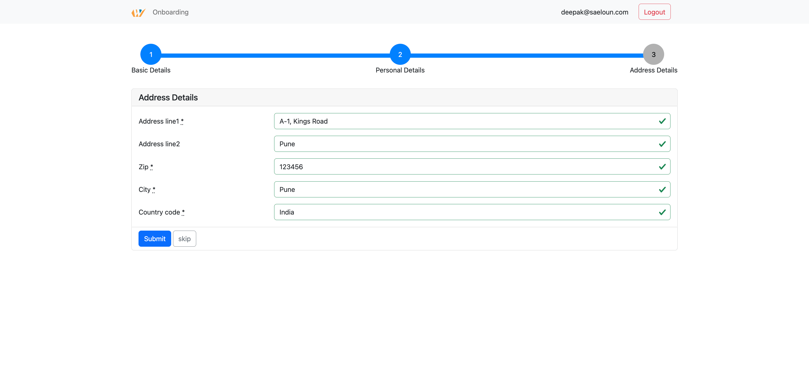

# README

Demo Application for wicked

This application is built with

- [auth0](https://auth0.com/) for authentication
- [bootstrap 5](https://getbootstrap.com/docs/5.0/getting-started/introduction/) for styling
- [simple form](https://github.com/heartcombo/simple_form) for form

## Screenshots

